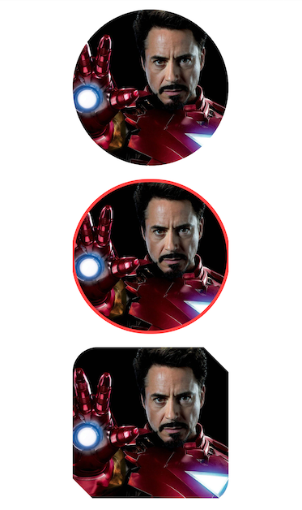

# SimpleCircleImageView
A show case of how you can achieve a circular image with just a few lines of code and without using any 3rd party library.

Every company and app I have got a chance to work on, I have seen one common thing, all of them have included some library for showing circular images. Those libraries are usually written by a seasonal developer and get deprecated very quickly resulting in bugs not being fixed. Removing or replace these libraries can be very expensive especially if the app code base is large. 

That's why I have written this app as a show case to show how simple it is to actually create a CircleImageView without using any 3rd party library.

| No Library | Material Design Library |
| -----------| ----------|
|  |  |

### Download

If you want to use the old method without the Material Design Library's ShapeableImageView then I have put it into a library.

```
implementation "io.github.informramiz:simplecircleimageview:1.2.0
```